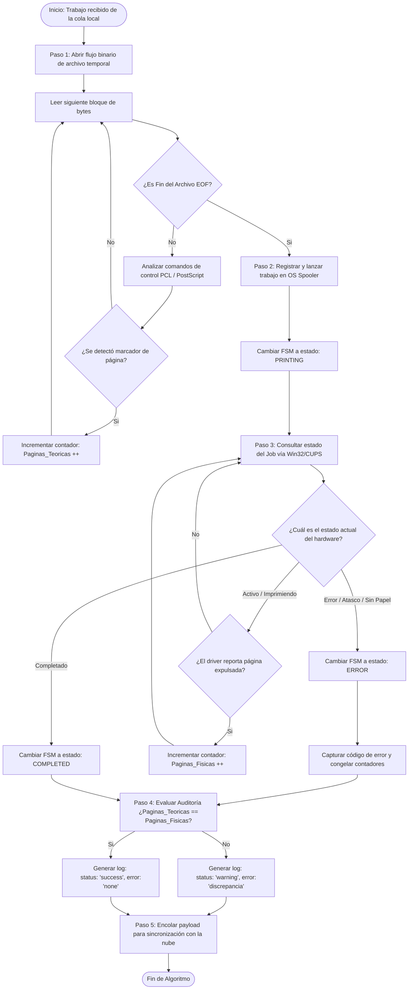
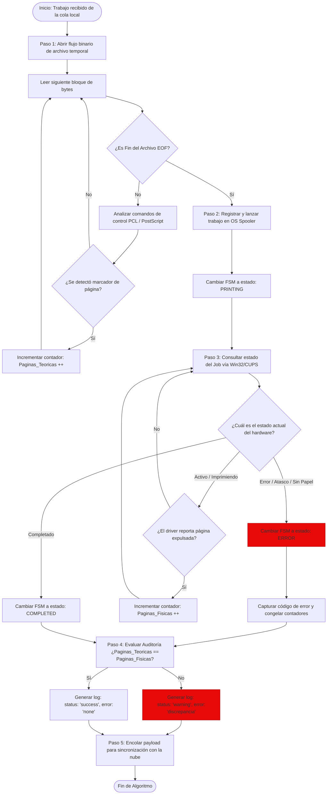

# SPOOLER AGENT SGI

Es un servicio nativo de segundo plano (daemon) diseñado para ejecutarse localmente en la red de la estación de impresión. Actúa como un puente asíncrono y desacoplado entre el hardware físico (impresoras) y la API del servicio en la nube, garantizando la resiliencia operativa del negocio y la integridad de los datos de facturación.

# *DOCUMENTACION*

## *DIAGRAMA ENTIDAD - RELACION*

## *DIAGRAMAS DE FLUJO*

### *Proceso de Análisis Binario de Archivos Spool y Conciliación Homóloga de Páginas*

### *Algoritmo de Intercepción de Spool Local, Monitoreo por FSM y Conciliación Física de Páginas*

