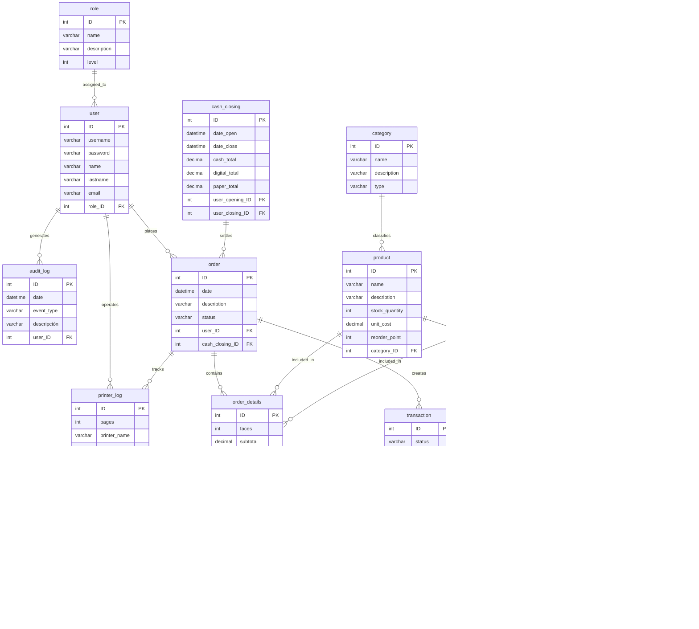

# SPOOLER AGENT SGI

# DOCUMENTACION
## DIAGRAMA ENTIDAD-RELACION

```mermaid

erDiagram
    role {
        int ID PK
        varchar name
        varchar description
        int level
    }

    user {
        int ID PK
        varchar username
        varchar password
        varchar name
        varchar lastname
        varchar email
        int role_ID FK
    }

    audit_log {
        int ID PK
        datetime date
        varchar event_type
        varchar descripción
        int user_ID FK
    }

    printer_log {
        int ID PK
        int pages
        varchar printer_name
        varchar printer_status
        text error_log
        int order_ID PK_FK
        int user_ID PK_FK
    }

    cash_closing {
        int ID PK
        datetime date_open
        datetime date_close
        decimal cash_total
        decimal digital_total
        decimal paper_total
        int user_opening_ID FK
        int user_closing_ID FK
    }

    order {
        int ID PK
        datetime date
        varchar description
        varchar status
        int user_ID FK
        int cash_closing_ID FK
    }

    order_details {
        int ID PK
        int faces
        decimal subtotal
        int quantity
        int order_ID FK
        int service_ID FK
        int product_ID FK
    }

    payment_method {
        int ID PK
        varchar name
        varchar description
    }

    payment_list {
        int ID PK
        varchar reference
        decimal amount
        int payment_method_ID FK
        int transaction_ID FK
    }

    transaction {
        int ID PK
        varchar status
        decimal total
        datetime date
        int order_ID FK
    }

    category {
        int ID PK
        varchar name
        varchar description
        varchar type
    }

    product {
        int ID PK
        varchar name
        varchar description
        int stock_quantity
        decimal unit_cost
        int reorder_point
        int category_ID FK
    }

    service {
        int ID PK
        varchar name
        varchar description
        decimal price
        boolean is_special
    }

    service_details {
        int ID PK
        int quantity_consumed
        int service_ID FK
        int product_ID FK
    }

    %% Relaciones del Sistema
    role ||--o{ user : "assigned_to"
    user ||--o{ audit_log : "generates"
    user ||--o{ order : "places"
    user ||--o{ printer_log : "operates"
    
    cash_closing ||--o{ order : "settles"
    order ||--o{ order_details : "contains"
    order ||--o{ transaction : "creates"
    order ||--o{ printer_log : "tracks"
    
    transaction ||--o{ payment_list : "processed_by"
    payment_method ||--o{ payment_list : "used_in"
    
    category ||--o{ product : "classifies"
    product ||--o{ order_details : "included_in"
    service ||--o{ order_details : "included_in"
    
    product ||--o{ service_details : "consumed_by"
    service ||--o{ service_details : "requires"

```
