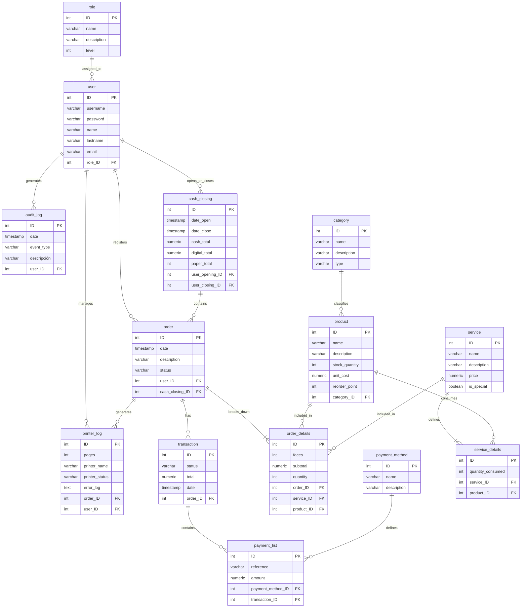

# SPOOLER AGENT SGI

Es un servicio nativo de segundo plano (daemon) diseñado para ejecutarse localmente en la red de la estación de impresión. Actúa como un puente asíncrono y desacoplado entre el hardware físico (impresoras) y la API del servicio en la nube, garantizando la resiliencia operativa del negocio y la integridad de los datos de facturación.

# *DOCUMENTACION*

## *DIAGRAMA ENTIDAD - RELACION*



## *DIAGRAMAS DE FLUJO*

### *Proceso de Análisis Binario de Archivos Spool y Conciliación Homóloga de Páginas*


### *Algoritmo de Intercepción de Spool Local, Monitoreo por FSM y Conciliación Física de Páginas*

```mermaid

%%{init: {'theme': 'base', 'themeVariables': { 'primaryColor': '#ffffff', 'primaryBorderColor': '#777', 'primaryTextColor': '#333', 'lineColor': '#777', 'secondaryColor': '#f4f4f4', 'tertiaryColor': '#ffffff'}}%%}

flowchart TD
    %% Node Styles
    classDef startend fill:#dae8fc,stroke:#6c8ebf,stroke-width:1px,color:#000000;
    classDef process fill:#d5e8d4,stroke:#82b366,stroke-width:1px,color:#000000;
    classDef decision fill:#fff2cc,stroke:#d6b656,stroke-width:1px,color:#000000;
    classDef auditCheck fill:#fff2cc,stroke:#d6b656,stroke-width:1px,color:#000000;

    %% START NODE
    A([Inicio: Trabajo recibido de la cola local]):::startend
    A --> B

    %% PART 1: BINARY FILE ANALYSIS (PCL/POSTSCRIPT)
    B[Paso 1: Abrir flujo binario de archivo temporal]:::process
    B --> C
    C[Leer siguiente bloque de bytes]:::process
    C --> D{¿Es Fin de Archivo EOF?}:::decision

    %% Branch NO (from EOF check)
    D -- No --> E[Analizar comandos de control PCL / PostScript]:::process
    E --> F{¿Se detectó marcador de página?}:::decision

    %% Branch NO (from Page Marker check) loops back
    F -- No --> C

    %% Branch YES (from Page Marker check)
    F -- Sí --> G[Incrementar contador: Paginas_Teoricas ++]:::process
    %% loops back from YES
    G --> C

    %% Branch YES (from EOF check)
    D -- Sí --> H[Paso 2: Registrar y lanzar trabajo en OS Spooler]:::process
    H --> I[Cambiar FSM a estado: PRINTING]:::process
    I --> J[Paso 3: Consultar estado del Job vía Win32/CUPS]:::process
    J --> K{¿Cuál es el estado actual del hardware?}:::decision

    %% PART 2: HARDWARE FSM & PHYSICAL PAGE CHECK
    %% Branch ACTIVE (from Hardware check)
    K -- "Activo / Imprimiendo" --> L{¿El driver reporta página expulsada?}:::decision

    %% Branch NO (from Page Expelled check) loops back
    L -- No --> J

    %% Branch YES (from Page Expelled check)
    L -- Sí --> M[Incrementar contador: Paginas_Fisicas ++]:::process
    %% loops back to step 3
    M --> J

    %% Branch COMPLETED (from Hardware check)
    K -- Completado --> N[Cambiar FSM a estado: COMPLETED]:::process

    %% Branch ERROR (from Hardware check)
    K -- "Error / Atasco / Sin Papel" --> O[Cambiar FSM a estado: ERROR]:::process
    O --> P[Capturar código de error y congelar contadores]:::process

    %% Merging of branches to the next phase
    N --> Q
    P --> Q

    %% PART 3: AUDIT AND COMPLETION
    Q([Paso 4: Evaluar Auditoría: ¿Paginas_Teoricas == Paginas_Fisicas?]):::auditCheck

    %% Decision branches out of standard box drawn in diagram (atypical mermaid, so using labels on arrows to box below)
    Q -->|No| R[Generar log: status: 'warning', error: 'discrepancia']:::process
    Q -->|Sí| S[Generar log: status: 'success', error: 'none']:::process

    %% Merging of audit branches
    R --> T
    S --> T

    %% Final Steps
    T[Paso 5: Encolar payload para sincronización con la nube]:::process
    T --> U

    %% END NODE
    U([Fin de Algoritmo]):::startend

```
